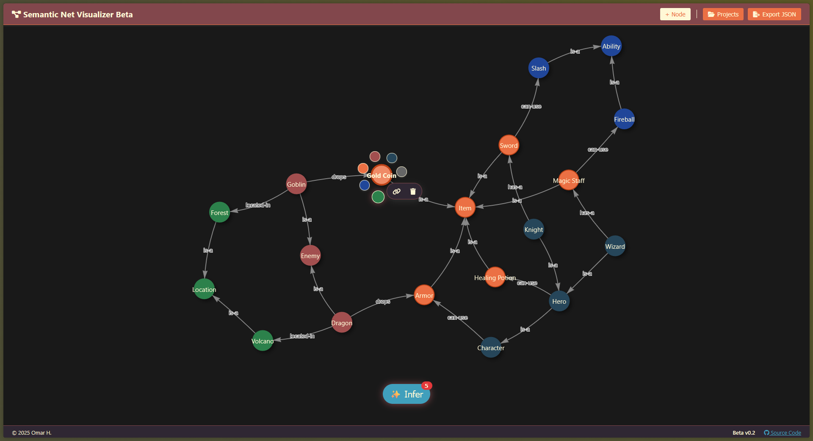

<div id="top">

<div align="center">

# SEMANTIC-NET-VISUALIZER

<em>See Your Ideas Connect, Think, and Evolve</em>


<em>Built with:</em>


---

**Checkout the Live Demo:** [semantic.omarg.dev](https://semantic.omarg.dev)



</div>

---

<details open>
<summary><b>⟡ Table of Contents</b></summary>

- [⟡ Table of Contents](#-table-of-contents)
- [◈ Overview](#-overview)
- [⟢ Features](#-features)
- [◇ Project Structure](#-project-structure)
  - [◊ Project Index](#-project-index)
- [⟠ Getting Started](#-getting-started)
  - [⟁ Prerequisites](#-prerequisites)
  - [⟒ Installation](#-installation)
  - [⟓ Usage](#-usage)
  - [⌆ Testing](#-testing)
- [⟲ Roadmap](#-roadmap)
- [⏣ Contributing](#-contributing)
- [⟶ License](#-license)
- [❈ Acknowledgments](#-acknowledgments)

</details>

---

## ◈ Overview

A web-based semantic network editor with a canvas-centric interaction model. Users build directed knowledge graphs by double-clicking to place nodes, dragging edges between them, and labeling relationships inline. A built-in inference engine traverses `is-a` hierarchies to propagate inherited relationships and surface conflicts in real time.

The backend is a Python/Flask REST API backed by NetworkX for graph logic. The frontend is pure HTML, CSS, and Vis.js — no framework dependencies. Projects are saved in a custom `.snet` format that bundles graph data, node positions, color palettes, and a base64-encoded canvas preview.

---

## ⟢ Features

| | Component | Details |
| :--- | :--- | :--- |
| ⚙️ | **Architecture** | Python Flask backend with a REST API. Pure HTML/CSS/Vis.js frontend. Client-server model with CORS-enabled endpoints. Custom `.snet` project format stores graph state, positions, palettes, and preview images. |
| 🧠 | **Inference Engine** | Traverses `is-a` edges in the NetworkX directed graph to propagate inherited relationships from parent nodes to child nodes. Runs in both dry-run (count) and mutating modes, and reports edge conflicts to the frontend. |
| 🖱️ | **Canvas Interactions** | Double-click on the canvas to create a node. Single-click a node or edge to open a context menu with color swatches, link-creation, and deletion. Drag from a node to initiate "Add Relation" mode, then label the new edge inline. |
| 🗂️ | **Project Management** | Load from a preset grid, import a `.snet` file from disk, or export the current graph as a downloadable `.snet` file with an embedded canvas preview thumbnail. |
| 🔌 | **Integrations** | GitHub Actions (`deploy.yml`) automates Docker builds and pushes to the production VPS on every push to `main`. `flask-cors` enables cross-origin frontend-backend communication. |
| 🧩 | **Modularity** | Frontend JavaScript is split across focused modules: `api.js` (fetch calls), `graph.js` (Vis.js config), `interactions.js` (event handling), `orbit.js` (physics), and `main.js` (entry point). |
| ⚡️ | **Performance** | Gunicorn WSGI server for production request handling. NetworkX provides efficient in-memory graph traversal. Static HTML frontend avoids client-side framework overhead. |

---

## ◇ Project Structure

```sh
└── semantic-net-visualizer/
    ├── .github/
    │   └── workflows/
    │       └── deploy.yml
    ├── Dockerfile
    ├── README.md
    ├── app.py
    ├── inference.py
    ├── project_manager.py
    ├── requirements.txt
    ├── semantic_net.py
    ├── projects/
    │   ├── Animal Kingdom.snet
    │   ├── Default.snet
    │   └── RPG World.snet
    ├── static/
    │   ├── style.css
    │   └── js/
    │       ├── api.js
    │       ├── graph.js
    │       ├── interactions.js
    │       ├── main.js
    │       └── orbit.js
    └── templates/
        └── index.html
```

### ◊ Project Index

<details open>
<summary><b>Root</b></summary>

| File | Summary |
| :--- | :--- |
| [app.py](https://github.com/omarg-dev/semantic-net-visualizer/blob/master/app.py) | Central Flask application and REST API gateway. Exposes endpoints for graph CRUD operations (`/add_node`, `/add_relation`, `/remove_node`, `/remove_relation`), inference (`/inference`, `/check_inference`), project persistence (`/load`, `/save`, `/export`), and static asset serving. |
| [semantic_net.py](https://github.com/omarg-dev/semantic-net-visualizer/blob/master/semantic_net.py) | Core graph model wrapping a NetworkX `DiGraph`. Manages node and edge creation with arbitrary attributes (color, position, type), delegates inference to the `Inference` engine, and serializes graph state to the JSON schema consumed by the frontend. |
| [inference.py](https://github.com/omarg-dev/semantic-net-visualizer/blob/master/inference.py) | Ontological inference engine. Traverses `is-a` edges to propagate inherited relationships from parent nodes to child nodes. Exposes a dry-run `count()` mode and a mutating `run()` mode that injects inferred edges and returns detected conflicts. |
| [project_manager.py](https://github.com/omarg-dev/semantic-net-visualizer/blob/master/project_manager.py) | Handles `.snet` file I/O for the `projects/` directory. Provides listing, loading, and saving of named projects, translating between the filesystem representation and the `SemanticNet` graph model. |
| [Dockerfile](https://github.com/omarg-dev/semantic-net-visualizer/blob/master/Dockerfile) | Builds a `python:3.10-slim` image, installs dependencies from `requirements.txt`, and runs the app via `python -m flask run`. Exposes port 4300. |
| [requirements.txt](https://github.com/omarg-dev/semantic-net-visualizer/blob/master/requirements.txt) | Python dependencies: `flask`, `flask-cors`, `networkx`, `gunicorn`. |

</details>

<details>
<summary><b>.github/workflows</b></summary>

| File | Summary |
| :--- | :--- |
| [deploy.yml](https://github.com/omarg-dev/semantic-net-visualizer/blob/master/.github/workflows/deploy.yml) | CD pipeline triggered on push to `main`. SSH-connects to the production VPS, pulls the latest code, rebuilds the Docker container, and prunes unused images. |

</details>

<details>
<summary><b>projects/</b></summary>

| File | Summary |
| :--- | :--- |
| [Default.snet](https://github.com/omarg-dev/semantic-net-visualizer/blob/master/projects/Default.snet) | Bundled starter project loaded on first run. Contains a minimal sample graph demonstrating basic node/edge structure. |
| [Animal Kingdom.snet](https://github.com/omarg-dev/semantic-net-visualizer/blob/master/projects/Animal%20Kingdom.snet) | Preset semantic network modeling an animal taxonomy hierarchy, useful for demonstrating `is-a` inference propagation. |
| [RPG World.snet](https://github.com/omarg-dev/semantic-net-visualizer/blob/master/projects/RPG%20World.snet) | Preset semantic network modeling an RPG entity hierarchy, showcasing cross-domain relationship modeling. |

</details>

<details>
<summary><b>templates/ & static/</b></summary>

| File | Summary |
| :--- | :--- |
| [templates/index.html](https://github.com/omarg-dev/semantic-net-visualizer/blob/master/templates/index.html) | Single-page HTML shell. Contains the Vis.js canvas container, context menu markup, project management modal, and inference control. Loads the JS modules and links the stylesheet. |
| [static/style.css](https://github.com/omarg-dev/semantic-net-visualizer/blob/master/static/style.css) | Application stylesheet. Defines canvas layout, modal overlays, context menus, and color swatch components. |
| [static/js/api.js](https://github.com/omarg-dev/semantic-net-visualizer/blob/master/static/js/api.js) | All `fetch()` calls to the Flask API. Abstracts HTTP transport from UI logic. |
| [static/js/graph.js](https://github.com/omarg-dev/semantic-net-visualizer/blob/master/static/js/graph.js) | Vis.js network initialization, physics configuration, and graph rendering helpers. |
| [static/js/interactions.js](https://github.com/omarg-dev/semantic-net-visualizer/blob/master/static/js/interactions.js) | Canvas event handlers: double-click to add nodes, click to open context menus, edge drag-and-label flow. |
| [static/js/main.js](https://github.com/omarg-dev/semantic-net-visualizer/blob/master/static/js/main.js) | Application entry point. Initializes the graph and wires API calls to interaction events. |
| [static/js/orbit.js](https://github.com/omarg-dev/semantic-net-visualizer/blob/master/static/js/orbit.js) | Physics and layout utilities for the Vis.js network. |

</details>

---

## ⟠ Getting Started

### ⟁ Prerequisites

- Python 3.10+
- pip
- Docker (optional, for containerized deployment)

### ⟒ Installation

**Option A — pip (local development)**

1. Clone the repository:

    ```sh
    git clone https://github.com/omarg-dev/semantic-net-visualizer
    cd semantic-net-visualizer
    ```

2. Install dependencies:

    ```sh
    pip install -r requirements.txt
    ```

**Option B — Docker**

1. Clone the repository:

    ```sh
    git clone https://github.com/omarg-dev/semantic-net-visualizer
    cd semantic-net-visualizer
    ```

2. Build the image:

    ```sh
    docker build -t semantic-net-visualizer .
    ```

### ⟓ Usage

**Using pip:**

```sh
python app.py
```

Then open [http://localhost:5000](http://localhost:5000) in your browser.

**Using Docker:**

```sh
docker run -p 4300:5000 semantic-net-visualizer
```

Then open [http://localhost:4300](http://localhost:4300) in your browser.

### ⌆ Testing

There is no automated test suite at this time. The bundled `.snet` preset files (`Default.snet`, `Animal Kingdom.snet`, `RPG World.snet`) serve as functional fixtures for manual verification of graph loading, inference, and export flows.

---

## ⟲ Roadmap

- [x] Canvas-centric node/edge creation (double-click, context menus)
- [x] `is-a` inheritance inference with conflict detection
- [x] Project save, load, and export in `.snet` format with embedded previews
- [x] Preset grid with thumbnail previews
- [x] Docker deployment with GitHub Actions CD pipeline
- [ ] Undo/redo stack (client-side JS state history)
- [ ] Node and edge rename by double-clicking
- [ ] Per-user local storage: cache project files on the client machine rather than the server, removing server-side file persistence
- [ ] Sidebar showing node list and properties
- [ ] Unsaved-changes indicator and in-place preset saving
- [ ] Custom color palette picker per project
- [ ] Real-time collaboration via Flask-SocketIO

---

## ⏣ Contributing

- **💬 [Join the Discussions](https://github.com/omarg-dev/semantic-net-visualizer/discussions)**: Share your insights, provide feedback, or ask questions.
- **🐛 [Report Issues](https://github.com/omarg-dev/semantic-net-visualizer/issues)**: Submit bugs or log feature requests.
- **💡 [Submit Pull Requests](https://github.com/omarg-dev/semantic-net-visualizer/blob/main/CONTRIBUTING.md)**: Review open PRs and submit your own.

<details closed>
<summary>Contributing Guidelines</summary>

1. **Fork the Repository**: Fork the project to your GitHub account.
2. **Clone Locally**: Clone the forked repository.

   ```sh
   git clone https://github.com/omarg-dev/semantic-net-visualizer
   ```

3. **Create a New Branch**: Use a descriptive branch name.

   ```sh
   git checkout -b feature/my-feature
   ```

4. **Make Your Changes**: Develop and test changes locally.
5. **Commit Your Changes**: Write a clear commit message.

   ```sh
   git commit -m 'Add my feature'
   ```

6. **Push to GitHub**: Push to your fork.

   ```sh
   git push origin feature/my-feature
   ```

7. **Submit a Pull Request**: Open a PR against `main`. Describe the change and its motivation clearly.
8. **Review**: PRs are merged after review and approval.

</details>

<details closed>
<summary>Contributor Graph</summary>
<br>
<p align="left">
   <a href="https://github.com/omarg-dev/semantic-net-visualizer/graphs/contributors">
      
   </a>
</p>
</details>

---

## ⟶ License

Semantic-net-visualizer is protected under the [LICENSE](https://choosealicense.com/licenses) License. For more details, refer to the [LICENSE](https://choosealicense.com/licenses/) file.

---

## ❈ Acknowledgments

- [Vis.js](https://visjs.org/) — network visualization library
- [NetworkX](https://networkx.org/) — graph data structure and algorithms
- [Flask](https://flask.palletsprojects.com/) — web framework
- [contrib.rocks](https://contrib.rocks) — contributor avatar grid

<div align="right">

[![][back-to-top]](#top)

</div>

[back-to-top]: https://img.shields.io/badge/-BACK_TO_TOP-151515?style=flat-square

---
